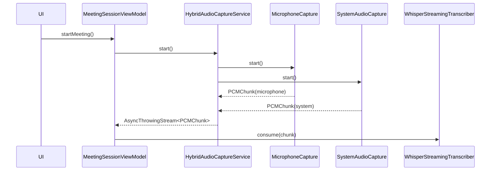
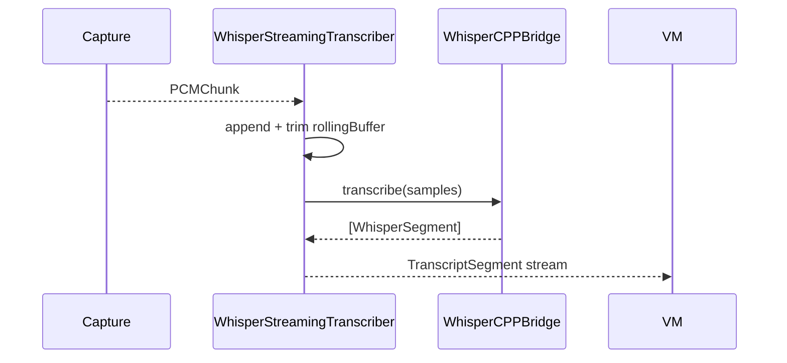
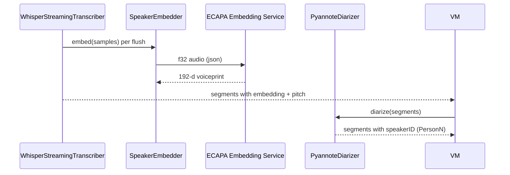
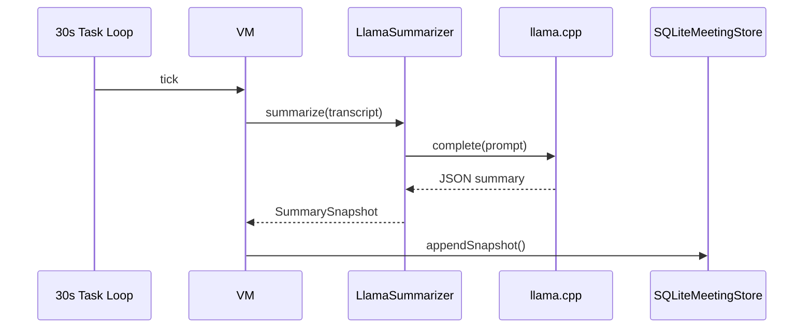
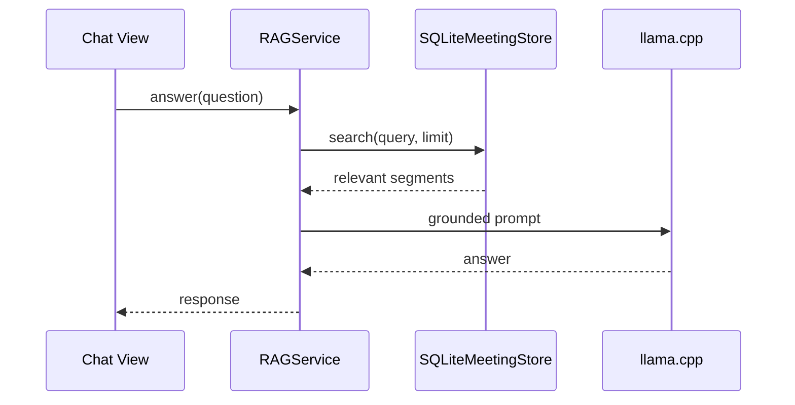

# LocalMeetingAssistant: Production Architecture (Local-Only, Apple Silicon)

## Why this architecture

- **Local-only privacy**: all audio, transcripts, embeddings, summaries, and reports remain on-device.
- **Low latency**: streaming pipeline with small audio windows, incremental transcription, and periodic summarization.
- **Resilience**: each phase has clear module boundaries with protocol-driven dependency injection.
- **Testability**: all external dependencies are behind interfaces and can be mocked.

## Global folder structure

```
LocalMeetingAssistant/
  Package.swift
  Sources/
    MeetingAssistantApp/
    AppCore/
    AudioCapture/
    Transcription/
    Diarization/
    Summarization/
    Storage/
    SearchRAG/
    Exporting/
    FeatureMeeting/
  Tests/
    AudioCaptureTests/
    TranscriptionTests/
    StorageTests/
  docs/
    PHASED_ARCHITECTURE.md
```

## Cross-cutting design decisions

- **Clean Architecture**
  - Domain and protocols in `AppCore`.
  - Infrastructure modules (`AudioCapture`, `Transcription`, `Storage`, etc.) implement protocol contracts.
  - UI in feature modules binds to view models.
- **MVVM**
  - `MeetingSessionView` binds to `MeetingSessionViewModel` only.
- **Async/await + stream pipeline**
  - Audio and transcript are modeled as `AsyncThrowingStream`.
- **Dependency Injection**
  - `DependencyContainer` constructs concrete implementations at app startup.
- **SQLite durability**
  - transcripts, snapshots, and meeting metadata are persisted continuously.

---

## Phase 1: Audio Capture

### Folder structure

```
Sources/
  AudioCapture/
    HybridAudioCaptureService.swift
    MicrophoneCapture.swift
    SystemAudioCapture.swift
```

### Swift classes

- `HybridAudioCaptureService`: facade that merges mic + system audio into one stream.
- `MicrophoneCapture`: AVAudioEngine input tap, low-latency PCM chunks.
- `SystemAudioCapture`: ScreenCaptureKit audio stream from display context.
- `SystemAudioOutputBridge`: converts sample buffers to float PCM.

### Data flow

1. User taps Start.
2. Meeting VM calls `audioCaptureService.start()`.
3. Mic and system capture start in parallel tasks.
4. Both emit `PCMChunk` events into shared stream.
5. Stream is consumed by transcription module.

### Sequence diagram



### Sample code

- Key implementation is in `HybridAudioCaptureService.start()`.
- `MicrophoneCapture` uses `installTap(onBus:bufferSize:format:)` for chunked streaming.
- `SystemAudioCapture` uses `SCStream` with audio capture enabled.

### Testing strategy

- Unit test lifecycle (`create/start/stop`) with fake emitters.
- Inject deterministic sample chunks and assert downstream consumption.
- Add integration test with entitlements in a host app target.

---

## Phase 2: Streaming Transcription

### Folder structure

```
Sources/
  Transcription/
    WhisperCPPBridge.swift
    WhisperStreamingTranscriber.swift
```

### Swift classes

- `WhisperEngine` protocol: interchangeable inference backend.
- `WhisperCPPBridge`: production bridge to whisper.cpp.
- `WhisperStreamingTranscriber`: rolling buffer + incremental segment emission.

### Data flow

1. Receives PCM chunks from capture stream.
2. Maintains a rolling N-second audio buffer.
3. Calls whisper.cpp on current window.
4. Emits transcript segments immediately.

### Sequence diagram



### Sample code

- `WhisperStreamingTranscriber.consume(chunk:)` performs rolling window update.
- `transcriptStream` publishes low-latency segment updates.

### Testing strategy

- Mock `WhisperEngine` and verify segment emission order.
- Validate rolling buffer truncation for memory stability.
- Performance benchmark: ms latency per chunk and CPU % on M1/M2.

---

## Phase 3: Speaker Diarization

### Folder structure

```
Sources/
  AppCore/
    SpeakerEmbedder.swift   (bridge to the Python embedding service)
  Diarization/
    PyannoteDiarizer.swift
scripts/
  diarization_embed.py      (ECAPA embedding service, implemented)
  pyannote_service.py       (optional full pyannote service, future)
```

### Swift classes

- `SpeakerDiarizer` protocol in core.
- `SpeakerEmbedder` (AppCore) manages the long-running Python ECAPA service and returns an L2-normalized voiceprint per utterance (nil when unavailable).
- `PyannoteDiarizer` actor clusters utterances online: ECAPA embeddings by cosine similarity (multi-exemplar per speaker), with pitch clustering as the fallback.

### Data flow

1. Transcript segments arrive from STT, each carrying a per-flush voice embedding (and pitch).
2. Diarizer scores each utterance against known speakers' exemplars by cosine similarity.
3. A new speaker is created when the best similarity falls below the threshold; otherwise the nearest speaker is reinforced.
4. VM merges labels into transcript segments.

### Sequence diagram



### Notes

- Embedding is computed ONCE per pause-bounded utterance (stable voiceprint), not per whisper sub-segment.
- When the embedding service can't start, the diarizer transparently falls back to on-device pitch clustering.
- A full pyannote-audio pipeline can later replace `diarization_embed.py` via `scripts/pyannote_service.py`.

### Testing strategy

- Unit test interval-to-segment mapping with edge overlaps.
- Contract test for python bridge JSON schema.
- End-to-end test: known multi-speaker sample fixture.

---

## Phase 4: Local LLM Summarization

### Folder structure

```
Sources/
  Summarization/
    LlamaSummarizer.swift
```

### Swift classes

- `LlamaEngine` protocol: abstract llama.cpp inference engine.
- `LlamaSummarizer`: periodic snapshots + final report generation.
- `SummarySnapshot`: summary + action items + decisions.

### Data flow

1. Every 30 seconds VM triggers summarization.
2. Last transcript window is converted into prompt.
3. llama.cpp returns constrained JSON.
4. Snapshot persisted into SQLite.

### Sequence diagram



### Sample code

- `MeetingSessionViewModel` runs 30-second periodic summarization task.
- `LlamaSummarizer.parseSnapshot(raw:)` parses JSON with fallback.

### Testing strategy

- Mock `LlamaEngine` with deterministic outputs.
- Verify extraction of action items and decisions.
- Fault tests for invalid JSON and prompt overflow truncation.

---

## Phase 5: RAG and Semantic Search

### Folder structure

```
Sources/
  Storage/
    SQLiteMeetingStore.swift
  SearchRAG/
    RAGService.swift
```

### Swift classes

- `TranscriptRetriever` protocol from core.
- `SQLiteMeetingStore`: basic text search now; extensible to FTS5 + vector table.
- `RAGService`: retrieve context + grounded answer generation.

### Data flow

1. User asks a question over prior meetings.
2. Retriever fetches top transcript chunks.
3. RAG composes grounded prompt.
4. llama.cpp returns answer constrained by retrieved context.

### Sequence diagram



### Sample code

- `RAGService.answer(question:)` composes context and enforces grounding.

### Testing strategy

- Mock retriever and llama engine to ensure prompt includes only retrieved text.
- Regression tests for hallucination guardrail strings.
- Benchmark retrieval latency with large transcript corpora.

---

## Export requirements

- Markdown: `ReportExporter.exportMarkdown(...)`.
- PDF: `ReportExporter.exportPDF(...)` using PDFKit rasterization path.

## Search and history requirements

- Meeting list query: `fetchMeetings(query:)`.
- Transcript retrieval for RAG: `search(query:limit:)`.

## Production hardening checklist

1. Add entitlement setup for microphone and screen recording.
2. Replace mock whisper/llama bridges with C/C++ wrappers to whisper.cpp and llama.cpp.
3. Introduce bounded channels/backpressure metrics to avoid memory spikes.
4. Add FTS5 tables and optional on-device embedding index.
5. Add crash-safe journaling and schema migrations.
6. Add structured logging and privacy-safe diagnostics.
7. Add power-mode profiles (balanced, low-power, high-accuracy).
8. Sign and notarize app for distribution.
